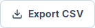
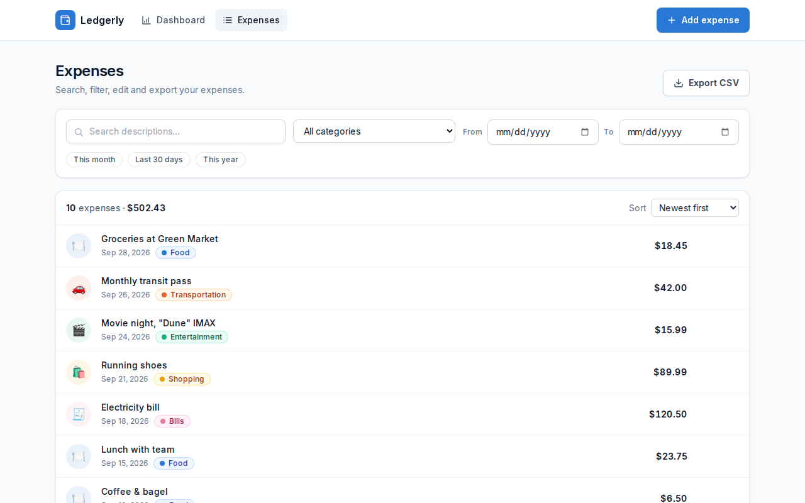
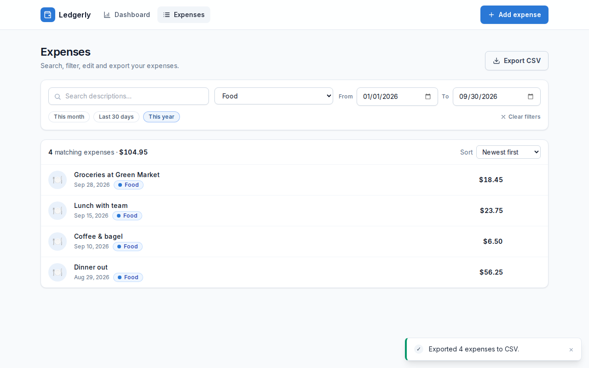
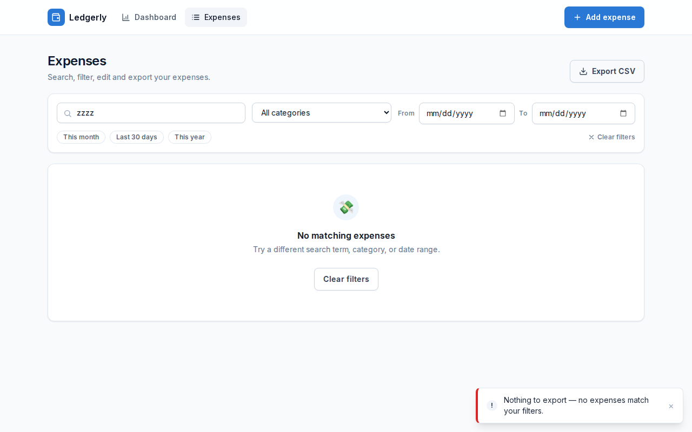

# Exporting Your Expenses

You can download your expenses as a **CSV file** and open it in Microsoft Excel, Apple Numbers, Google Sheets or any other spreadsheet app. Use it to keep a backup, do your own analysis, or share your spending with an accountant.

The file is created on your own device. Your expense data is never uploaded anywhere.

---

## Export all your expenses

1. Click **Expenses** in the top navigation bar.
2. Click **Export CSV** in the top-right corner of the page.

   

3. Your browser downloads a file named like `expenses-2026-09-30.csv`, using today's date.



---

## Export only some of your expenses

The export includes **exactly the expenses shown in the list**. Narrow down the list first, then export:

- **Search:** type in *Search descriptions…* to match words in the description or category name.
- **Category:** choose a single category, such as *Food*.
- **Date range:** set **From** and **To** dates, or click a shortcut: **This month**, **Last 30 days** or **This year**.
- **Sort:** rows in the file follow the order you pick in the **Sort** menu, such as *Newest first* or *Highest amount*.

When you click **Export CSV**, a message in the bottom-right corner confirms how many expenses were exported.



> **Tip:** The list shows 25 expenses at a time, with a **Show more** button. You don't need to click **Show more** before exporting. Every matching expense is included, whether or not it's on screen.

To export everything again, click **Clear filters**.

---

## What's in the file

The file has one row per expense and four columns:

| Column | Example | Notes |
|---|---|---|
| **Date** | `2026-09-28` | Year-month-day, which sorts correctly in any spreadsheet |
| **Category** | `Food` | |
| **Description** | `Groceries at Green Market` | |
| **Amount** | `18.45` | A plain number with no `$` sign, so you can add up or chart the column right away |

Example of the file contents:

```
Date,Category,Description,Amount
2026-09-28,Food,Groceries at Green Market,18.45
2026-09-15,Food,Lunch with team,23.75
2026-09-10,Food,Coffee & bagel,6.50
2026-08-29,Food,Dinner out,56.25
```

Descriptions containing commas, quotation marks, accents or other languages' characters are preserved and display correctly in Excel.

---

## Troubleshooting

**"Nothing to export — no expenses match your filters."**



No expenses match your current search or filters, so there was nothing to export. Click **Clear filters** or widen your date range, then try again. You'll also see this message if you haven't added any expenses yet.

**"Export failed. Please try again."**

Something went wrong while creating the file. Try again. If it keeps happening, make sure your browser allows downloads from this site, or try another browser.

**The Export CSV button is greyed out.**

Your expenses are still loading. Wait a moment and the button becomes available.

**A description starts with an apostrophe (`'`) in my spreadsheet.**

This is deliberate. If a description begins with `=`, `+`, `-` or `@`, a spreadsheet app could treat it as a formula and run it. The apostrophe makes the app show the text exactly as you typed it.

**I can't find the downloaded file.**

It's saved to your browser's usual download location, usually your **Downloads** folder. The file name starts with `expenses-`.

---

## Privacy

Exporting happens entirely in your browser. Nothing is sent to a server. Once downloaded, the file is an ordinary file on your device, so store and share it with the same care as any other financial record.
