# Exporting & Sharing Your Expenses

Ledgerly's **Export & Sync** hub is where your spending data goes out into the world. You can:

- **Send** a ready-made report to your device, email, or a connected app
- **Share** a read-only report with anyone using a link or a QR code
- **Schedule** exports so they happen automatically (set it and forget it, no cap)
- **Look back** at every export you've ever run

> **Heads up: demo mode.** Email, Google Sheets, Dropbox, OneDrive, Notion and Slack are **simulated**: nothing is actually sent to those services, and they're marked **SIMULATED** in the app. **Downloads, schedules, history and share links are fully real.**

---

## Getting there

Click **Exports** in the top navigation bar, or click **Export & share** on the Expenses page.

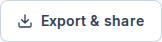

> **Changed from the old CSV export:** exports no longer follow the search, category and date filters on the Expenses page. Instead, you pick a **report** and a **period** in the hub (details below).

If you haven't added any expenses yet, the Send and Share tabs show *"Nothing to export yet"*. Add a few expenses first and you're good to go.

---

## Send a report

The **Send** tab walks you through three steps. The **preview** on the right updates live, so you can see exactly what you'll get before you send anything. It's giving "what you see is what you get."

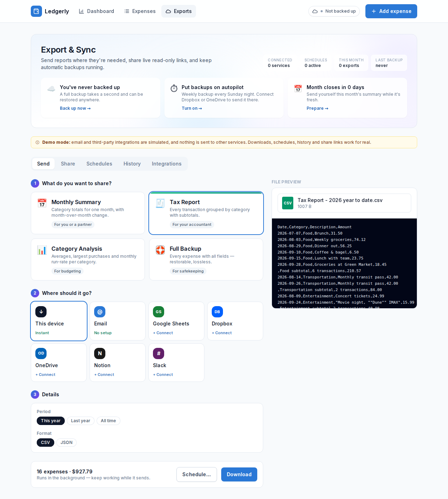

### Step 1: What do you want to share?

Pick one of four reports:

| Report | What's in it | Periods you can pick | Default format |
|---|---|---|---|
| 📅 **Monthly Summary** | Total for each category, its share of spending, and the change vs. the previous month | This month, Last month | CSV |
| 🧾 **Tax Report** | Every transaction grouped by category, with subtotals and a grand total. Your accountant will think you understood the assignment | This year, Last year, All time | CSV |
| 📊 **Category Analysis** | Per category: number of transactions, total, average, largest purchase, monthly spend and share of the total | Last 3 months, Last 6 months, This year, All time | CSV |
| 🛟 **Full Backup** | Every expense with every field (ID, created and updated times). Lossless, so you can restore from it | All time | JSON |

### Step 2: Where should it go?

| Destination | What happens | Setup |
|---|---|---|
| **This device** | The file downloads straight to your Downloads folder | None, it's instant |
| **Email** *(simulated)* | Sends the report as an attachment to up to 10 people | None |
| **Google Sheets** *(simulated)* | Creates a new spreadsheet, or adds rows to an existing one | Connect first |
| **Dropbox** / **OneDrive** *(simulated)* | Uploads the file to a folder you choose (default `/Ledgerly`) | Connect first |
| **Notion** *(simulated)* | Publishes the report as a Notion database | Connect first |
| **Slack** *(simulated)* | Posts a formatted summary to a channel (default `#finance`) | Connect first |

For **Email**, type an address and press **Enter**, a comma or a space to add it as a recipient. You can also set a subject and a message. The preview turns into an email preview so you can check the vibe before sending.

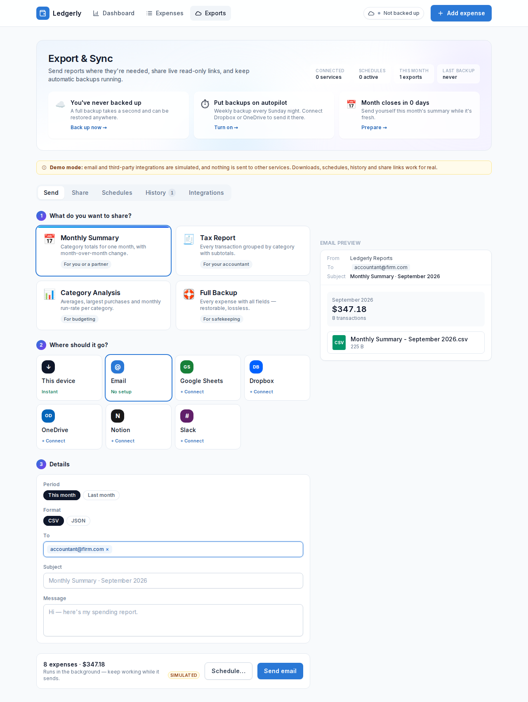

Services marked **+ Connect** ask for permission the first time you pick them. Click **Allow access** and you're connected. In demo mode this doesn't actually contact the service; the connection is only stored in your browser.

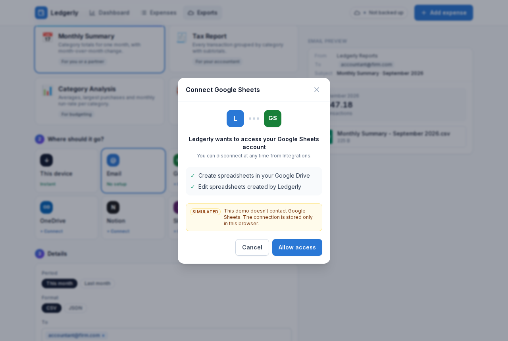

### Step 3: Details

- **Period:** the time range the report covers.
- **Format:** **CSV** (opens in Excel, Numbers or Google Sheets) or **JSON** (for developers and backups). This option is hidden for Google Sheets, Notion and Slack, because those create their own spreadsheet, database or message instead of a file.
- **Destination settings:** the recipients, folder, sheet name or channel for the destination you picked.

### Send it

The bottom bar shows how many expenses and what total the report covers. Click the main button (**Download**, **Send email**, **Upload to Dropbox** and so on) to start the export.

Exports run **in the background**, so you can keep using the app. A progress panel (the **activity tray**) appears in the bottom-right corner and shows a ✓ when the export is done.

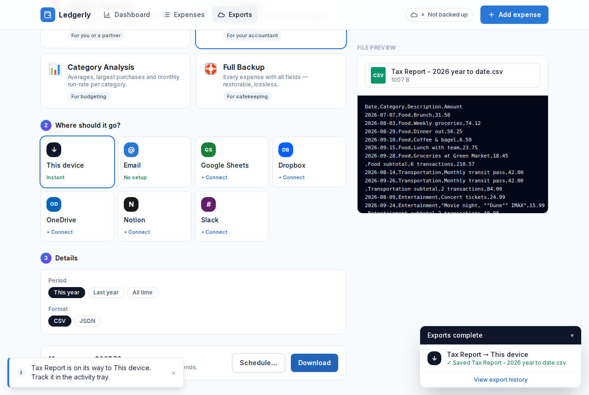

Downloaded files get readable names, like `Tax Report - 2026 year to date.csv` or `Ledgerly backup 2026-09-30.json`.

> **Tip:** Want this exact export every week? Click **Schedule…** instead of sending. Your choices carry over into a new schedule. (More on schedules below.)

---

## Share a read-only link

The **Share** tab creates a link to a clean, read-only report. Anyone can open it, no account needed. Lowkey the most useful part of the hub for splitting bills or doing budget check-ins with a partner.

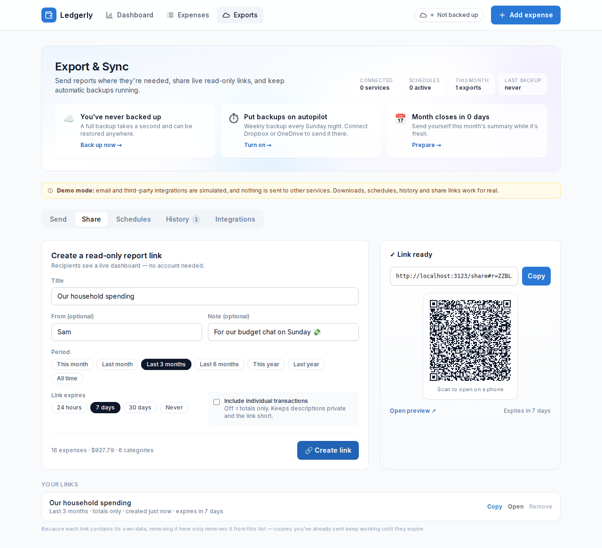

1. Give the report a **Title**. You can also add your name (**From**) and a **Note**.
2. Pick a **Period**, anywhere from *This month* to *All time*.
3. Choose when the **link expires**: 24 hours, 7 days, 30 days or Never.
4. Decide whether to **Include individual transactions**:
   - **Off** (default): the report shows totals only, so your descriptions stay private and the link stays short.
   - **On**: the report also lists every transaction, and the recipient can search them and download a CSV.
5. Click **🔗 Create link**, then **Copy** the link or let someone scan the **QR code**. If the link is too long for a reliable QR code, the app says so. Turning off individual transactions usually fixes that.

Here's what the recipient sees:

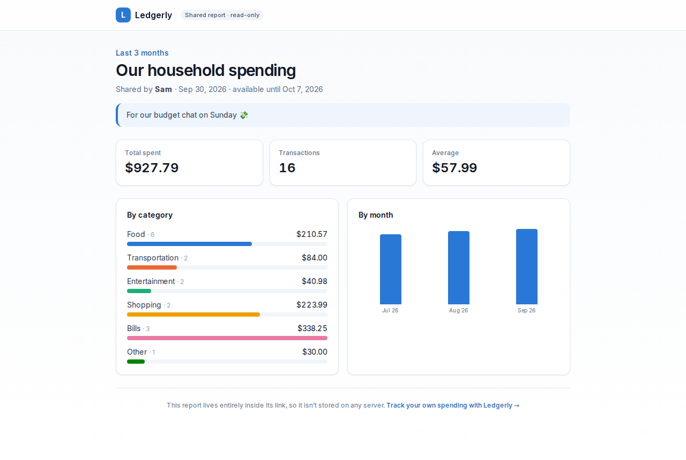

### How share links work (and why it slaps for privacy)

The report is compressed **into the link itself**, in the part after the `#`. Browsers never send that part to a server, so your data isn't stored anywhere except inside the link.

Because of that, a few things are worth knowing:

- **Treat the link like the data itself.** Anyone who has it can see the report, so only send it to people you trust.
- **Removing a link only takes it off your "Your links" list.** Copies you've already sent keep working until they expire.
- **Expiry hides the report page after the date passes.** The data is still inside the link, though, so for anything sensitive, choose totals only and a short expiry.

---

## Schedule automatic exports

The **Schedules** tab runs exports for you daily, weekly or monthly. It's the main-character move for anyone who always forgets to back up.

New here? Start from a **recipe**:

- **Weekly backup:** a full JSON backup every Sunday night
- **Monthly summary email:** last month's summary, sent on the 1st
- **Category pulse to Slack:** category analysis every Monday

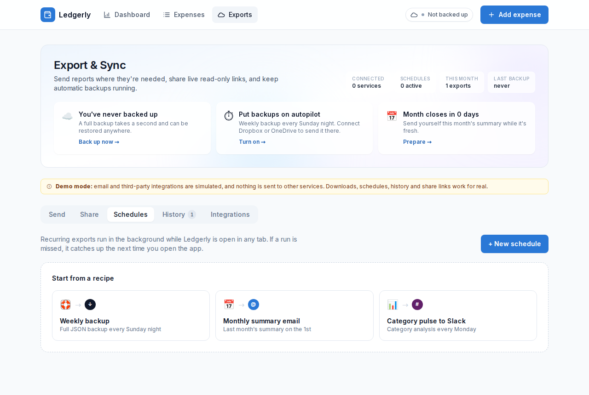

Or click **+ New schedule** and set it up yourself: a name, the report, the destination, how often it repeats, and the time. The form shows exactly when the next run will be.

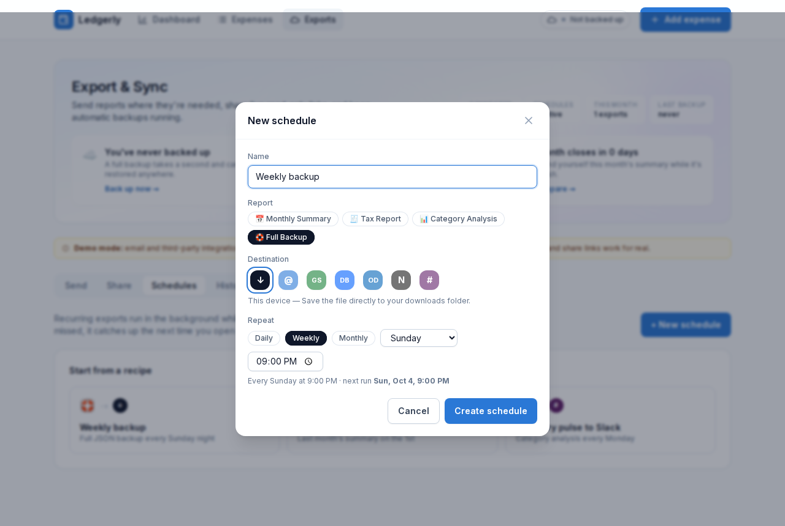

Each schedule card shows its next and last run. You can also:

- turn it **off or on** with the switch (pause without deleting),
- **Run now**, **Edit** or **Delete** it.

> ⚠️ **Important, fr:** schedules only run **while Ledgerly is open in a browser tab**. If a run is missed because the app was closed, it runs once the next time you open Ledgerly. There's no server running exports in the background.

---

## Export history

The **History** tab logs every export, whether you ran it yourself, a schedule ran it, or it was a backup. At the top you'll see the number of exports, how much data was delivered, and the success rate.

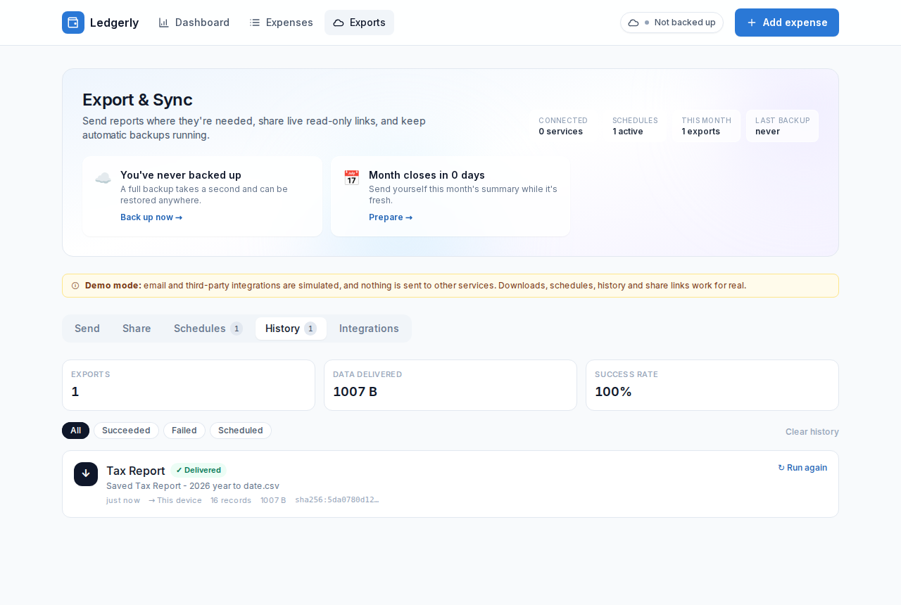

- **Filter** by All, Succeeded, Failed or Scheduled.
- Each entry shows the file name, number of records, size and a **SHA-256 checksum**. Click the checksum to copy it, so you can check the file hasn't been changed.
- Click **↻ Run again** to repeat any export with the same settings.
- **Clear history** removes the log (after you confirm). It doesn't delete any files.

History keeps your 50 most recent exports.

---

## Backup status & tips

The cloud icon in the top bar shows your backup status at a glance:

| Status | Meaning |
|---|---|
| **Not backed up** | You haven't made a Full Backup yet |
| **N unsynced** | You've added or edited N expenses since your last backup |
| **Backed up** | Your latest backup is up to date. Immaculate vibes ✨ |
| **Syncing…** | A backup is running right now |

Click it to see the details, **Back up now** (this saves a JSON file to your device), or set up automatic backups.

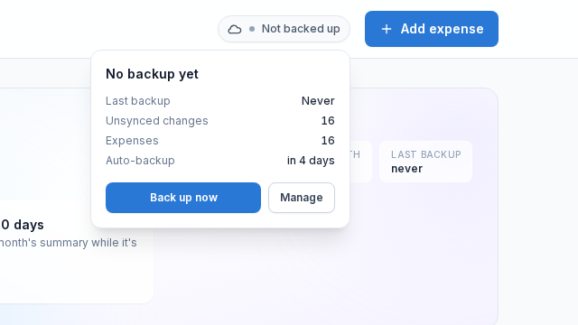

The top of the Export & Sync page also shows up to three **suggestion cards** based on what's going on. For example, a reminder to back up, a nudge before the month ends, a tax-season prompt from January to April, or an invite to create your first share link. One click and it's done. Easy W.

---

## Manage connected services

The **Integrations** tab lists every destination and whether it's connected. Click **Connect** or **Disconnect** to manage each one. QuickBooks, Xero, Excel Online and Webhooks are listed as *coming soon*.

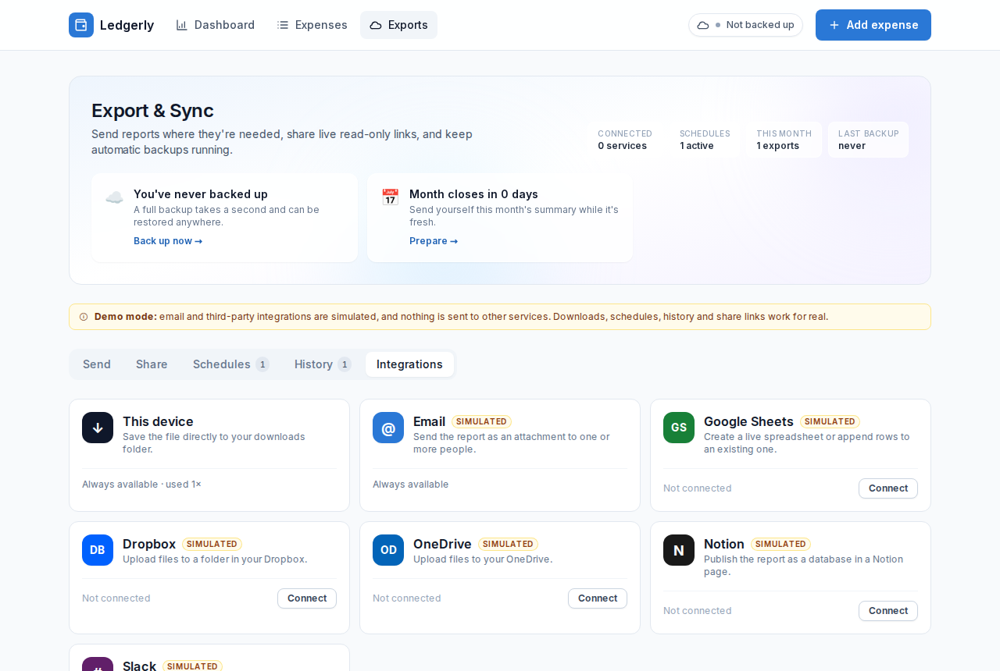

If you disconnect a service, any schedules that send to it will fail until you reconnect it.

---

## What's in the files

### CSV

The columns depend on the report. For example, here's a **Tax Report**:

```
Date,Category,Description,Amount
2026-07-07,Food,Brunch,31.50
2026-08-03,Food,Weekly groceries,74.12
,Food subtotal,2 transactions,105.62
2026-09-24,Entertainment,"Movie night, ""Dune"" IMAX",15.99
,Entertainment subtotal,1 transactions,15.99
,TOTAL,3 transactions,121.61
```

- Amounts are plain numbers with no `$` sign, so spreadsheet math just works.
- Dates use `YYYY-MM-DD`, so they sort correctly.
- Accented and non-English characters display correctly in Excel.
- If a description starts with `=`, `+`, `-` or `@`, a `'` is added at the front. That stops spreadsheet apps from treating it as a formula, which would be a big L for security. Numbers like `+22%` in the Monthly Summary are left as they are.

### JSON

JSON files include the report name, period, when the file was made, the number of records, the total (in USD) and all the rows. Choose JSON (or the Full Backup report) when you want a complete copy of your data.

---

## Troubleshooting

| Message | What to do |
|---|---|
| *No expenses in this period — pick a different period.* | The period you picked has no expenses. Try a wider one, like *This year* or *All time*. |
| *Add at least one recipient.* / *"…" isn't a valid email address.* | Add a valid email address and press **Enter**. |
| *Enter the name of the sheet to append to.* | You chose **Append to existing** for Google Sheets. Type the sheet's name. |
| *Folder paths start with "/".* | Dropbox and OneDrive folders need to start with `/`, e.g. `/Ledgerly`. |
| *Channel should look like #finance.* | Slack channels need a `#` and no spaces. |
| *… isn't connected. Reconnect it under Integrations.* | The service was disconnected. Reconnect it on the **Integrations** tab and run the export again. |
| *Couldn't create the link in this browser.* | Your browser doesn't support what share links need. Try an up-to-date Chrome, Edge, Firefox or Safari. |
| Recipient sees *"This link isn't valid"* | The link got cut off when it was copied. Send it again, or turn off individual transactions to make it shorter. |
| Recipient sees *"This report has expired"* | The expiry date has passed. Create a new link. |
| A scheduled export didn't run | Schedules only run while Ledgerly is open. Open the app and it catches up. |
| The email / Sheets / Dropbox export never arrived | That's demo mode. Those destinations are simulated. Use **This device** to get a real file. |

---

## Privacy, no cap

- Everything happens **in your browser**. Your expenses, connections, schedules and history are stored on this device.
- In demo mode, **no data is sent to any third-party service**.
- Share links hold their data inside the link itself, so share them carefully.
- Downloaded files are regular files on your device, so keep them as safe as any other financial record. Your future self will thank you, periodt.
